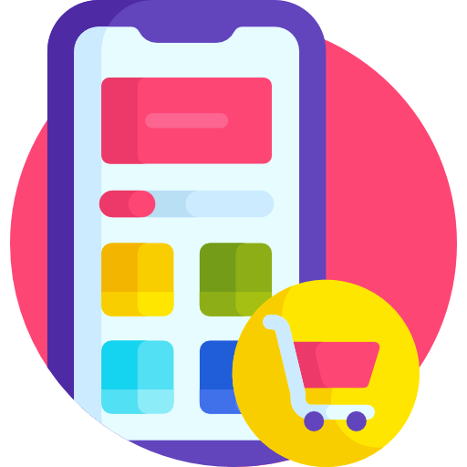
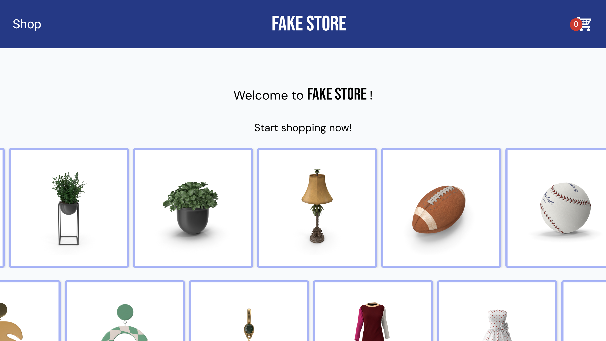

<a id="top"></a>

<div align="center">
    <a href="https://github.com/NestorNebula/shopping-cart">
        
    </a>
    
<h3>Shopping Cart</h3>
</div>

## About



This project is a mock Shopping site.

It can be used to simulate Shopping online. Users can add (or remove) items to their cart and confirm their (fake) command.

The fake data is fetched from the [DummyJSON API](https://dummyjson.com).

#### Updates

🟢 January 2025<br />

- Update the project language from JavaScript to TypeScript
- Add cart storage via local storage
- Change some styles and add icon

### Built With

[](https://react.dev/)
[](https://vite.dev/)
[](https://vitest.dev/)
[](https://www.typescriptlang.org/)


## Getting Started

### Prerequisites

- NPM

### Installation

1. Fork the [Project repository](https://github.com/NestorNebula/shopping-cart)
2. Clone the forked repository to your local machine
   ```
   git clone git@github.com:<your username>/<repo name>.git
   ```
3. Update remote URL

   ```
   # SSH:
   git remote add upstream git@github.com:NestorNebula/shopping-cart.git

   # HTTPS:
   git remote add upstream https://github.com/NestorNebula/shopping-cart.git
   ```

4. Install required packages
   ```
   npm install
   ```
5. Run the tests
   ```
   npm test
   ```
6. Open the app in development mode
   ```
   npm run dev
   ```

If an error occurs, make sure you have done everything properly according to this guide. If you think so, you can <a href="https://github.com/NestorNebula/shopping-cart/issues">Open an Issue</a>.

## Usage

Once the app is running, you should be able to start the app locally.

## Contributing

If you find an issue within the app or want to contribute, you can <a href="https://github.com/NestorNebula/shopping-cart/issues">Open an Issue</a>.

## License

[](https://github.com/NestorNebula/shopping-cart/blob/main/License.txt)

## Contact

Noa Houssier - [Github](https://github.com/NestorNebula)

## Acknoledgements

- [DummyJSON](https://dummyjson.com/)
- [Flaticon](https://www.flaticon.com/)
- [Material Design Icons](https://pictogrammers.com/library/mdi/)
- [Skill Icons](https://skillicons.dev/)

<p align='right'>(<a href='#top'>go back to the top</a>)</p>
